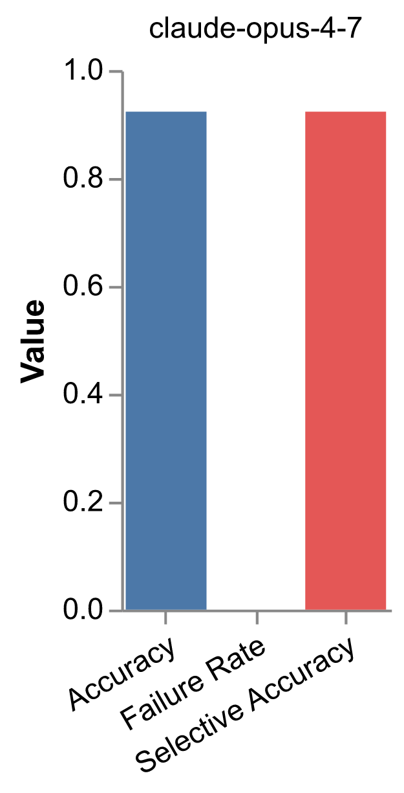
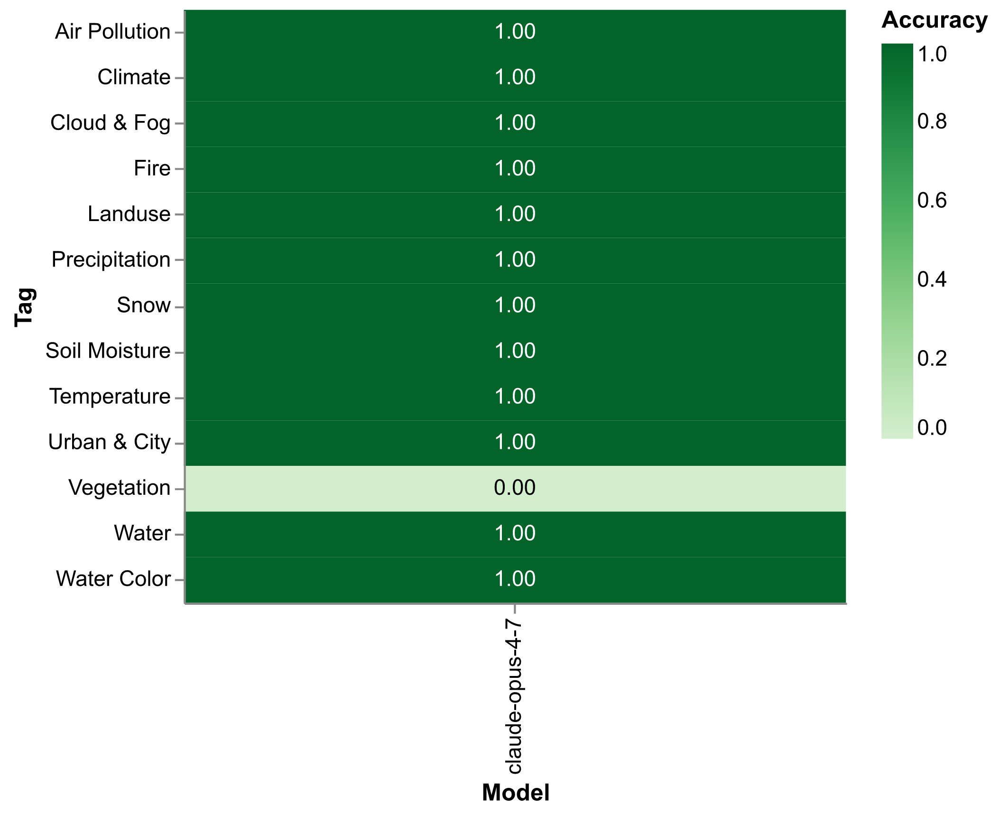
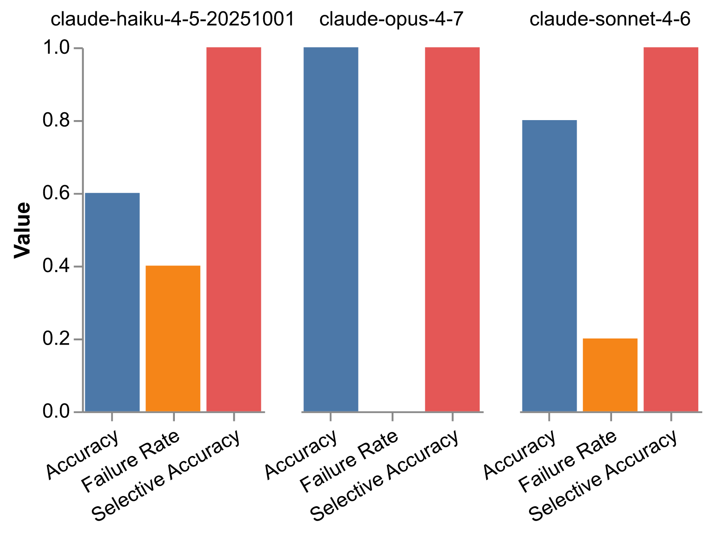
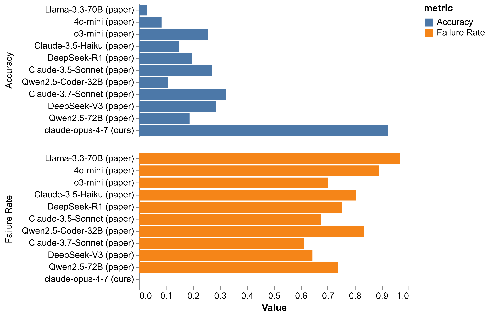

# 研究背景

**Google Earth Engine（GEE）** 是当前应用最广泛的云端地理空间分析平台

**痛点**：

- 复杂的 JavaScript / Python API
- 上千个数据集与函数，学习成本高
- 调试链路冗长（写代码 → 跑 → 看 console → 修 → 再跑）
- 多步骤分析任务需要熟悉 GEE 内部机制

**机会**：大语言模型在代码生成与工具调用上取得突破，
为自然语言驱动的地理空间分析提供新可能

---

# Earth Agent 是什么

一个 **Chrome 浏览器扩展 + MCP 服务器**，把 LLM 代理范式引入 GEE 在线编辑器

**两种使用方式**：

1. **扩展独立使用**：自带聊天面板，直接对话操作 GEE
2. **MCP 接入外部 AI**：让 Claude Code、Cursor、Zed 等编辑器通过 MCP 协议直接调用 GEE 工具

**关键创新**：闭环交互（closed-loop）

- 不仅生成代码，还能 **执行 → 观察结果 → 修正**
- LLM 直接感知 GEE 运行环境（控制台、地图、Inspector）
- 实现自主的多步骤地学分析工作流

**已上线 Chrome Web Store + 开源**

---

# 系统架构

```
+-----------------------------------------------+
| 外部 AI 编辑器 (Claude Code / Cursor / Zed)   |
+----------------------+------------------------+
                       | stdio (MCP Protocol)
                       v
+-----------------------------------------------+
| MCP Server  (earth-agent-mcp, npm)            |
+----------------------+------------------------+
                       | WebSocket (port 3847)
                       v
+-----------------------------------------------+
| Chrome Extension (Background Service Worker)  |
|   - AI Provider 调用 (OpenAI/Anthropic/Google)|
|   - 工具调度与状态管理                        |
|   - Side Panel UI（独立模式）                 |
+----------------------+------------------------+
                       | Chrome APIs
                       v
+-----------------------------------------------+
| Google Earth Engine 代码编辑器                |
|   内容脚本注入：DOM 操作、Ace Editor 控制     |
+-----------------------------------------------+
```

**所有 LLM Provider 通过 AI SDK 统一封装**：OpenAI / Anthropic / Google / 自定义

---

# 闭环交互：核心创新

LLM 不只是"代码生成器"，而是真正的"代理人"：

| 能力 | 工具 |
|------|------|
| 写代码 | `writeCode`、`editCode` |
| 跑代码 | `runCurrentCode` |
| 读控制台 | `getConsoleOutput` |
| 看地图 | `screenshot`（多模态视觉） |
| 查文档 | `geeDocs`（GEE Datasets + API） |
| 点要素 | `clickAtScreenPosition`、Inspector |

**典型流程**（agent 自主完成）：

> 用户："Medina 城市从 1984 到 2018 是否扩张？"
> Agent：查 GEE 数据集 → 写 Landsat 计算代码 → 跑 → 读控制台
> → 数字看起来不对 → **截图地图验证** → 改方法 → 再跑
> → "ANSWER: Yes"

---

# 方法论护栏（Methodology Guardrails）

为提升地学任务质量，引入 7 条领域知识作为系统级 prompt：

1. **数值合理性校验**：极端值要重新检查方法
2. **跨传感器可比性**：避免 Landsat 5/8 NDBI 直接比较
3. **优先成熟产品**：JRC GSW、MCD12Q1、GHSL 等
4. **干旱区识别**：NDBI 在沙漠不可靠 → 用夜光数据
5. **避免任意阈值**：单一阈值要溯源 + 敏感性测试
6. **空间可视化验证**：可疑结果用截图核实
7. **GEE 限额内**：禁止 `Export.*`，控制 `scale`/`bestEffort`

**作用**：通过 Chrome Extension 的 Custom Instructions 注入，
不修改 benchmark prompt（避免 overfitting）

---

# 评测：UnivEARTH 基准

**数据集**：UnivEARTH (Sun et al., 2024) — 140 道 Yes/No 地球观测题

**13 个标签**：Air Pollution, Climate, Cloud & Fog, Fire, Landuse,
Precipitation, Snow, Soil Moisture, Temperature, Urban & City,
Vegetation, Water, Water Color

**两种评测方式**：

- **Type 1**（Internal）：扩展自带 AgentTestPanel 批量跑
- **Type 2**（External）：通过 MCP 让外部 AI 编辑器跑

**本次报告：Type 1，分层抽样 13 题（每个标签 1 题，固定随机种子）**

**已确保可复现性**：git SHA、模型版本、Custom Instructions SHA256、抽样种子全部快照

---

# 实验设置

**模型**：

- Smoke test：Haiku 4.5 / Sonnet 4.6 / Opus 4.7（5 题对比）
- 主实验：Claude Opus 4.7（13 题分层抽样）

**关键工程优化**：

- AI SDK v6 prompt caching（system + tools，1h TTL）
- `experimental_repairToolCall`：自动修复畸形 JSON 工具调用
- 截图 JPEG quality 60（兼容 Helicone 日志）
- stepCountIs(100)：允许深度推理链

**遥测**：所有 LLM 调用通过 Helicone 记录，包括 token、cost、tool call 链路

---

# 结果 1：Opus 4.7 在 stratified_13 上达成 **92.3%**

{width=50%}

- **准确率：12 / 13 = 92.3%**
- **失败率：0 / 13 = 0%**
- **选择性准确率：12 / 13 = 92.3%**

唯一答错的是 Vegetation（Q43000），Agent 答 No、GT 是 Yes，
属于 ground truth 解读分歧的边界 case

---

# 结果 2：13 个标签的覆盖

{width=70%}

12/13 标签满分（深绿 = 1.00），仅 Vegetation 一题失分

---

# 结果 3：跨模型对比（5 题 smoke test）

{width=85%}

| Model | Accuracy | Failure | Selective Acc |
|-------|---------:|--------:|--------------:|
| Haiku 4.5 | 60% | 40% | 100% |
| Sonnet 4.6 | 80% | 20% | 100% |
| **Opus 4.7** | **100%** | **0%** | **100%** |

**所有模型选择性准确率均为 100%**：当 agent 能完整答完，答案总是对的

---

# 结果 4：相比 UnivEARTH 论文 baseline 的飞跃

{width=75%}

- 论文最强 baseline（DeepSeek-V3）：~32% 准确率
- 论文最强 baseline 失败率：均 > 60%
- **Earth Agent + Opus 4.7：92.3% 准确率，0% 失败率**

提升幅度约 **3 倍**

---

# 讨论：能力提升来自何处？

1. **闭环工具链**：执行 → 观察 → 修正 弥补单次代码生成的不足
2. **多模态视觉验证**：截图工具让 agent 能像人类一样核实地图结果
3. **方法论 guardrails**：跨传感器、干旱区、合理性校验等领域知识
4. **更强的 LLM**：Opus 4.7 推理能力 + tool use 稳定性
5. **prompt caching**：使长链路 tool 调用经济可行

**关键洞见**：选择性准确率始终为 100%，
说明失败模式主要是基础设施问题（连接断、API 过载），
而非模型推理错误

---

# 工程挑战与解决

| 问题 | 解决 |
|------|------|
| Service Worker 30s 终止 | keep-alive ping + chrome.alarms |
| Anthropic 偶发畸形 tool JSON | `experimental_repairToolCall` 兜底 |
| Helicone 大请求 body 丢失 | PNG → JPEG quality 60 |
| Claude 4.6+ 拒绝 temperature | 自动检测并删除参数 |
| 跨模型成本差异巨大 | Sonnet/Haiku 跑全集 + Opus 跑困难子集策略 |

**全部修复均已 commit 到主分支**

---

# 未来工作

1. **完整 140 题评测**：扩展到全 UnivEARTH 数据集
2. **Type 2 (MCP) 评测**：对比扩展自带 vs 外部编辑器调用
3. **多模型矩阵**：GPT-5.4 / Gemini 3.1 / DeepSeek-V3 同台对比
4. **Reflexion / few-shot**：反思与示例对失败题的补救能力
5. **Custom Instructions 消融实验**：量化 guardrails 的边际收益
6. **细粒度任务难度梯度**：从单步查询到多步分析

---

# 总结

**Earth Agent**：

- 首个专为 GEE 设计的闭环 LLM 代理系统
- Chrome 扩展 + MCP 双形态，已开源、已上架
- 方法论 guardrails 让通用 LLM 适配地学领域

**评测**：

- Opus 4.7 在 UnivEARTH 分层子集达到 **92.3% 准确率，0% 失败率**
- 相比 UnivEARTH 论文最强 baseline（~32%）提升约 3 倍
- 选择性准确率 100% 说明失败几乎都是工程问题，非推理错误

**意义**：证明配备工具链与领域护栏的 LLM 代理
可以胜任真实的多步地学分析工作流

**致谢 & 开源链接**：
GitHub: <https://github.com/Davidxswang/earth-agent-ai-sdk>

---

# 谢谢！

**Q&A**

GitHub: <https://github.com/Davidxswang/earth-agent-ai-sdk>
Chrome Web Store: 搜索 "Earth Agent"
NPM: `earth-agent-mcp`
