# System Patterns: Google Earth Engine Agent

## Architecture Overview

The Google Earth Engine (GEE) Agent is built as a Chrome extension with a multi-layered architecture:

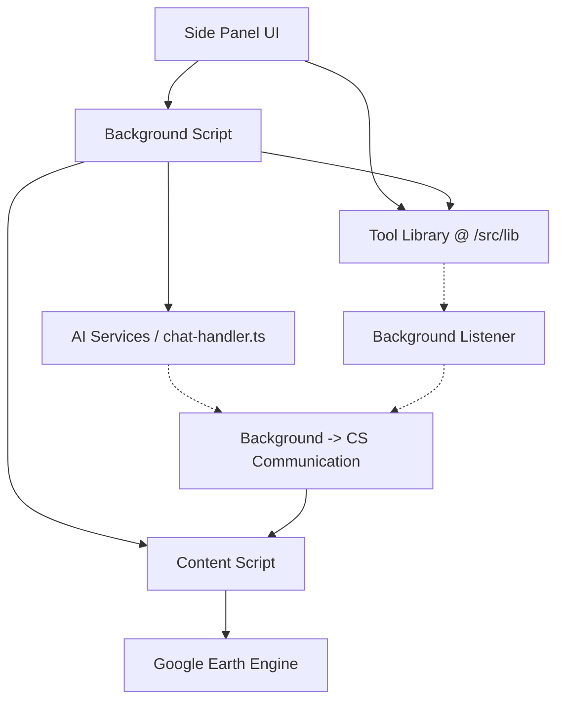

### Key Components & Flow

1.  **Side Panel UI (`src/components/`)**: Primary user interface (React). Can directly call functions from the Tool Library for actions like UI-driven tests.
2.  **Tool Library (`src/lib/tools/`)**: Contains reusable functions (`editScript`, `runCode`, etc.) designed for GEE interaction. These functions detect their execution context and use `chrome.runtime.sendMessage` when called from the UI or content script.
3.  **Background Script (`src/background/`)**: Core orchestration layer.
    *   **`index.ts` (Main Listener):** Listens for `chrome.runtime.onMessage` events from the UI or Tool Library functions. Uses a helper (`sendMessageToEarthEngineTab`) to find the EE tab, validate the content script, and relay the message to the content script using `chrome.tabs.sendMessage`.
    *   **`chat-handler.ts` (AI Handler):** Handles AI interactions using Vercel AI SDK. Defines AI tools (`earthEngineScriptTool`, etc.). The `execute` block for these tools *must* implement the logic to find the EE tab, validate/inject the content script, and send messages *directly* to the content script using `chrome.tabs.sendMessage`. It **does not** call the Tool Library functions to avoid `window is not defined` errors in the background context.
4.  **Content Script (`src/content/`)**: Injected into the GEE page. Listens for messages from the background script (`chrome.tabs.onMessage`) and performs actual DOM interactions (e.g., editing CodeMirror, clicking Run).
5.  **AI Services**: External LLMs (Claude, GPT) accessed via Vercel AI SDK in `chat-handler.ts`.

## Agent Architecture

### Client-Side Agent (Current Implementation)

Utilizes the Vercel AI SDK within `chat-handler.ts` for agent capabilities:
- Sequential tool execution (e.g., `earthEngineDataset` -> `earthEngineScript` -> `earthEngineRunCode`).
- In-context reasoning between steps.
- Streaming responses.
- **Tool Execution Pattern (Background -> Content Script):** AI tool definitions in `chat-handler.ts` handle the direct `chrome.tabs.sendMessage` to the content script for page interactions.

### Server-Side Agent (Future Consideration)

Leveraging Mastra or Langchain could provide persistent memory and more complex orchestration but adds server-side infrastructure requirements.

## Message Flow Patterns

### User Query Processing (AI)

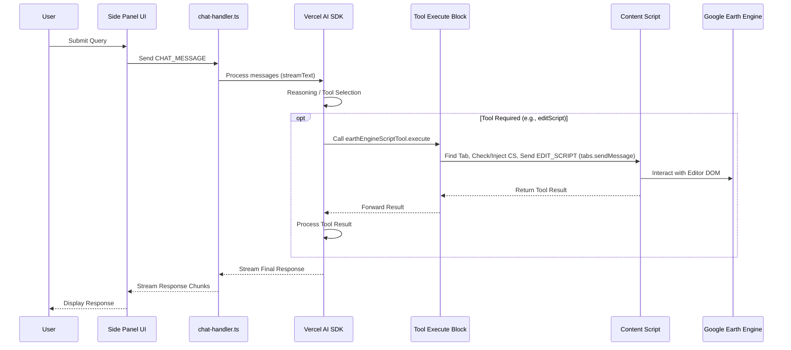

### Direct UI Tool Call (e.g., Test Button)

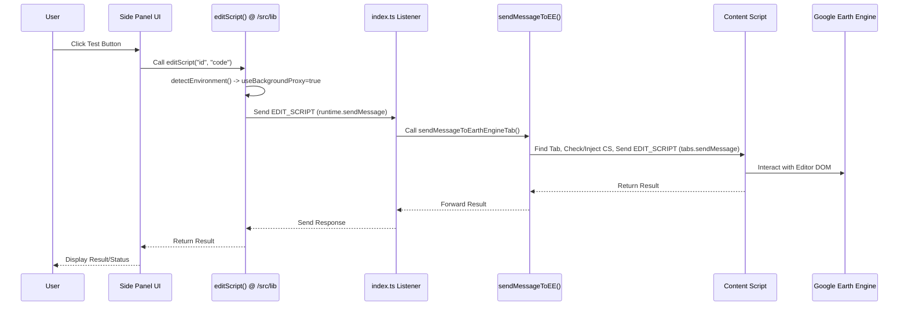

## Component Patterns

### Side Panel UI
(Remains largely the same - standard React component structure)

### Tools Implementation
- **Reusable Functions (`src/lib/tools/`)**: Contain core logic, environment detection, and `runtime.sendMessage` for delegation.
- **AI Tool Definitions (`src/background/chat-handler.ts`)**: Define schema for AI, contain `execute` block with background-safe logic using `tabs.sendMessage` for page interactions.
- **Content Script Handlers (`src/content/index.ts`)**: Implement the actual DOM manipulation logic triggered by messages from the background.

## Data Flow Patterns

### Context Gathering

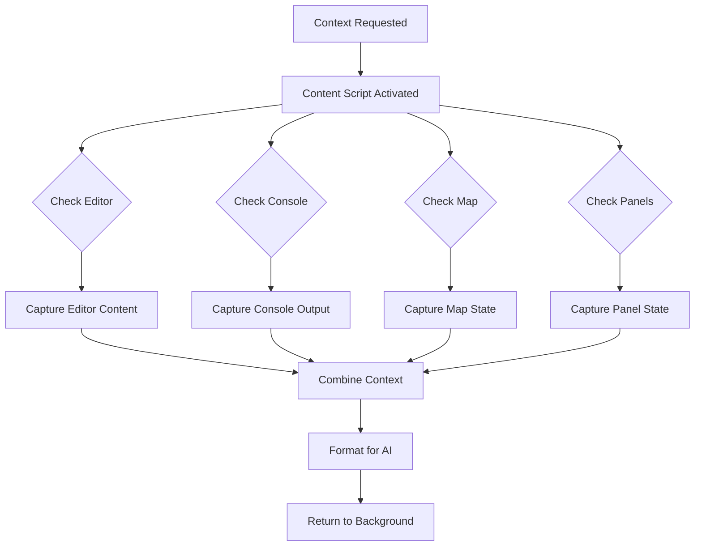

### User Interface State Management

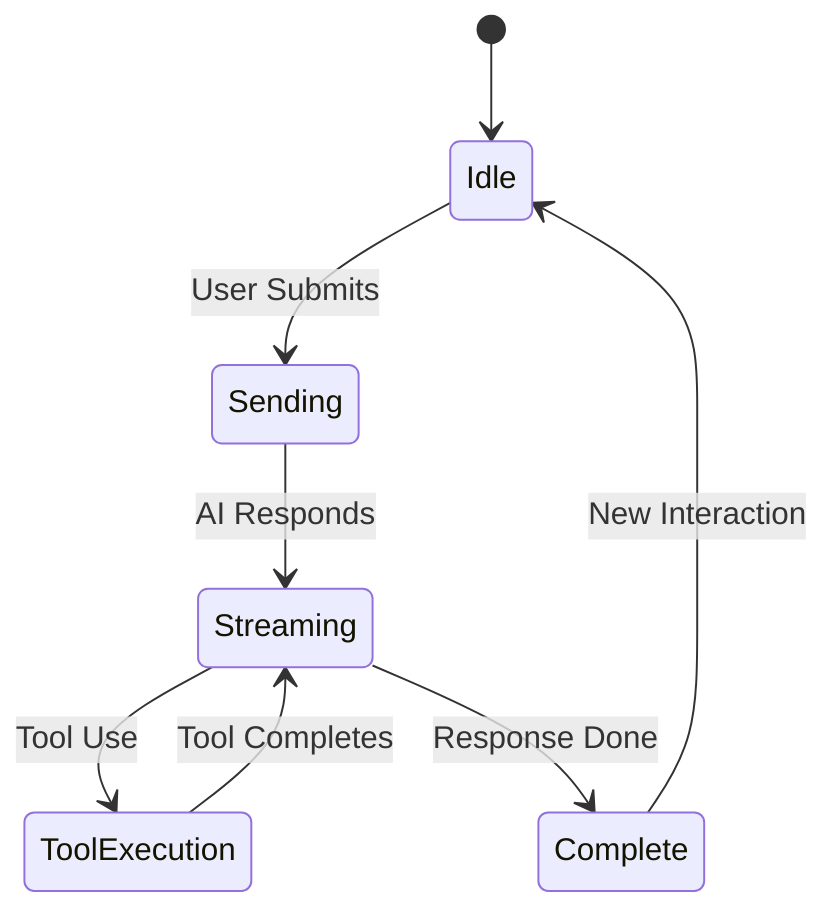

## Agent System Patterns

The agent system follows these patterns:

### Decision Making Flow

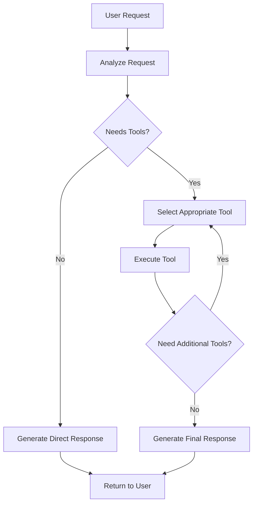

### Multi-Step Tool Execution Pattern

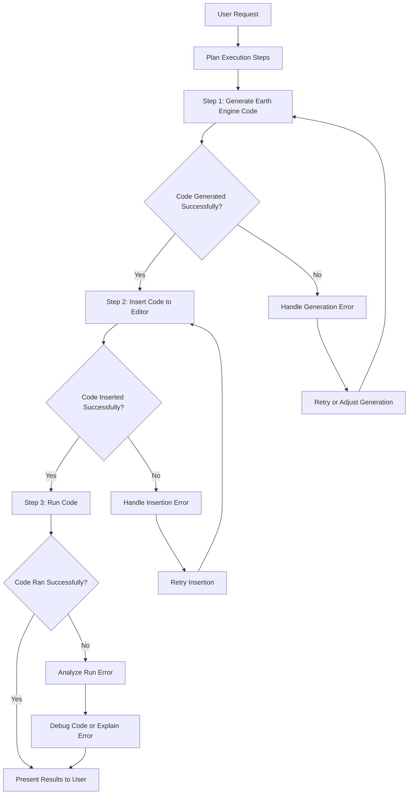

### Agent Implementation with Vercel AI SDK

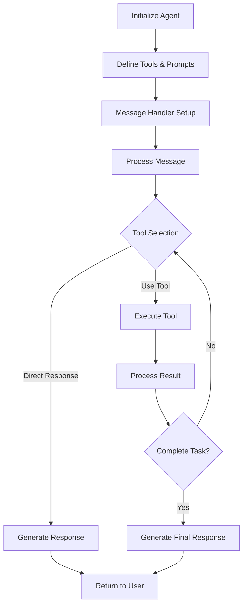

The implementation uses the Vercel AI SDK's agent capabilities following this pattern:
- Tool definitions with JSON Schema
- Agent prompt with tool instructions
- FunctionCallingHandler for tool execution  
- Tool callbacks for content script operations
- Stream handling for progressive responses

## Error Handling Patterns

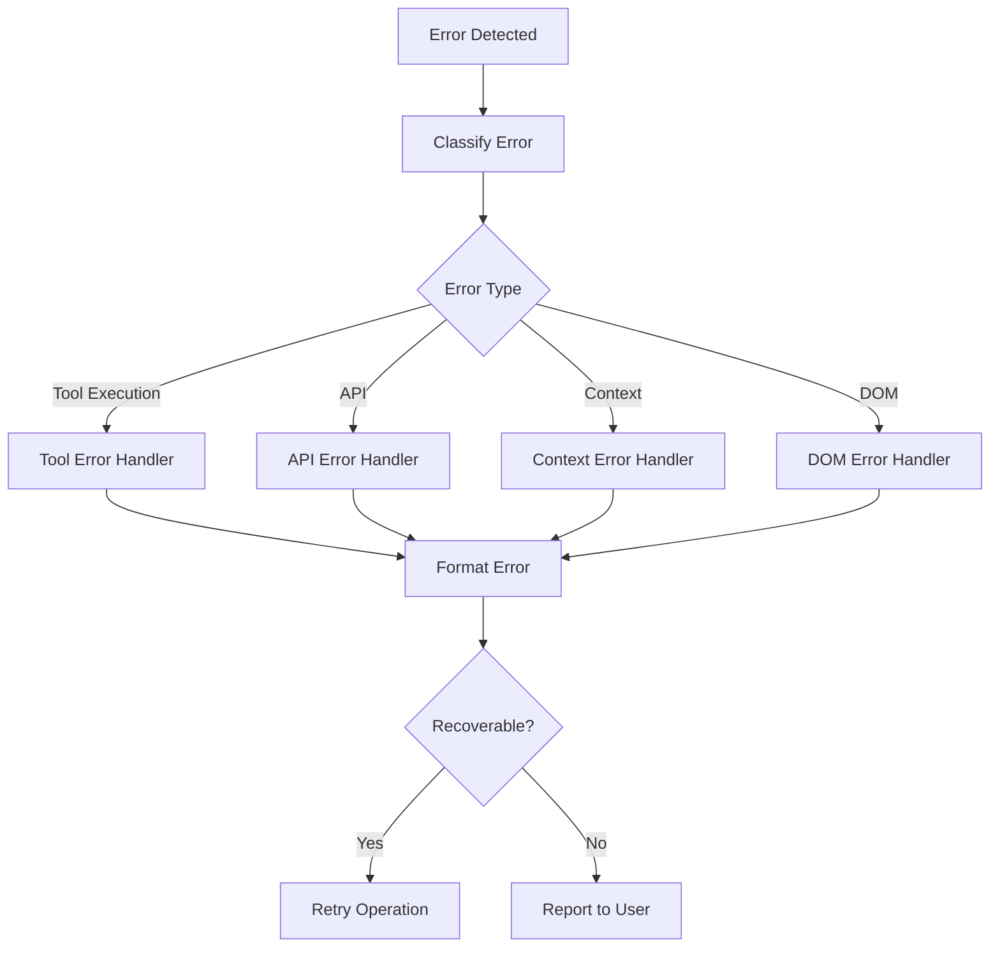

## Security Patterns

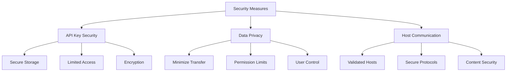

## Memory and State Management

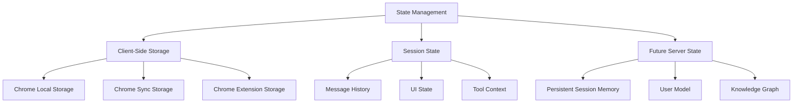

## Testing Patterns

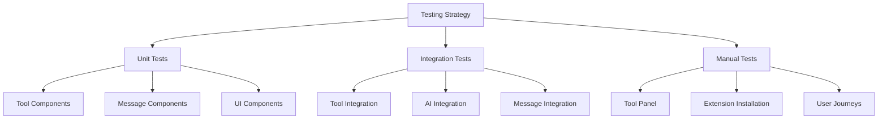

## Extension Integration Points

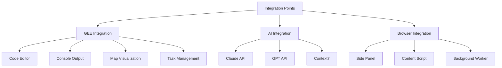

## Development Workflow

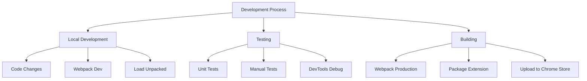

## Performance Optimization

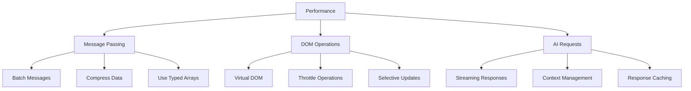

## Future Architecture Considerations

### Potential Server-Side Components

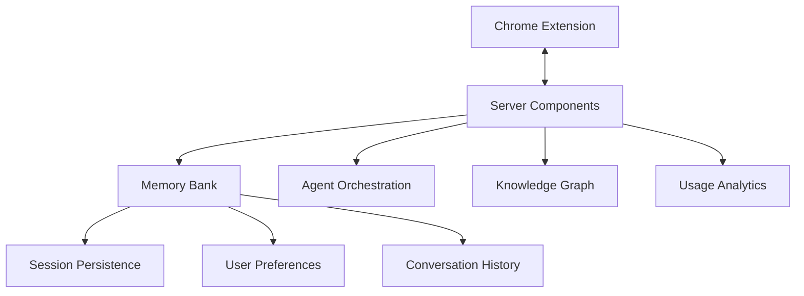

### Multi-Agent System

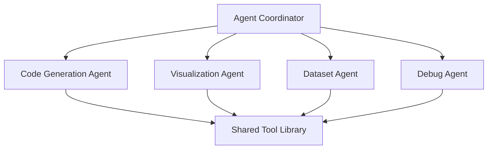

### Progressive Enhancement

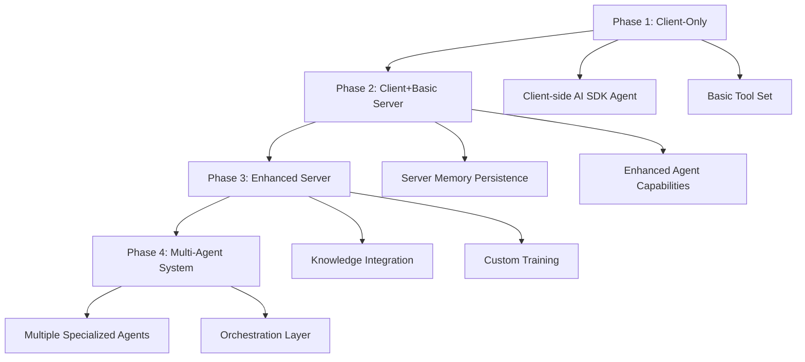

## Chrome Extension Architecture (Updated August 5, 2024)

The Earth Agent extension follows a standard Chrome extension architecture with clear separation of responsibilities:

1. **Background Script**: Central hub that coordinates all extension functionality
   - Located in `src/background/`
   - Runs persistently in the background
   - Handles message routing between components
   - Manages API requests and external services
   - Contains the AI agent logic in `chat-handler.ts`

2. **Content Script**: Runs in the context of Google Earth Engine web pages
   - Allows interaction with the page content
   - Communicates with the background script

3. **Side Panel UI**: User interface for interacting with the extension
   - Implemented with React components
   - Communicates with the background script via Chrome messaging

#### Key Components

- **Background Script (`src/background/`)**
  - `index.ts`: Main entry point handling message routing and tab connections
  - `chat-handler.ts`: Core AI logic for handling chat messages and tool execution

- **UI Components (`src/components/`)**
  - `Chat.tsx`: Main chat interface that passes messages to the background script
  - Supporting components for the UI experience

- **Content Script**
  - Interacts with Google Earth Engine pages
  - Extracts relevant information for the AI

- **Tools Library (`src/lib/tools/`)**
  - Context7 integration for documentation retrieval
  - Weather information tool
  - Earth Engine dataset documentation tool

### Background-centric Message Flow

1. User inputs a message in the UI (`Chat.tsx`)
2. Message is sent to the background script via Chrome messaging
3. Background script processes the message in `chat-handler.ts`
4. If tools are needed, they are called within the handler
5. Response is streamed back to the UI via the messaging port

### Agent Workflow Patterns

The Earth Engine assistant implements a sophisticated AI agent workflow based on the following patterns:

1. **Chaining Workflow for Dataset-Code Generation**:
   - When user asks about maps or visualizations, the agent follows a sequential process:
   - Step 1: Agent calls the earthEngineDataset tool to retrieve dataset information
   - Step 2: Agent processes the dataset information and metadata
   - Step 3: Agent generates code examples based on the retrieved dataset details
   
2. **Tool Integration Pattern**:
   - Tools are defined using Vercel AI SDK's tool interface
   - Each tool has a clear description, parameter schema, and execute function
   - Tools are made available to the AI model via the streamText configuration
   - The system prompt instructs the agent on when and how to use specific tools

3. **Error Resilience Pattern**:
   - Tools implement fallback mechanisms for communication failures
   - Context7 documentation retrieval first attempts Chrome messaging
   - Automatically falls back to direct API calls when primary method fails
   - Detailed logging captures tool execution performance and issues
``` 