# System Patterns: Google Earth Engine Agent

## Architecture Overview

The Google Earth Engine (GEE) Agent is built as a Chrome extension with a multi-layered architecture:

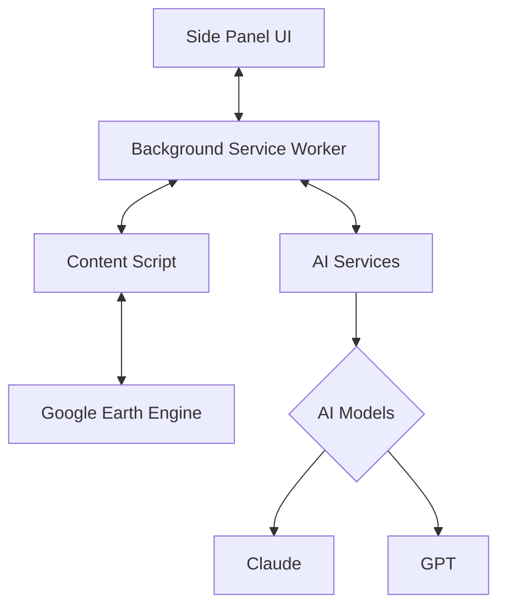

### Key Components

1. **Side Panel UI**: Primary user interface housed in Chrome's side panel
2. **Background Service Worker**: Core orchestration layer handling API requests and message routing
3. **Content Script**: DOM interaction layer injected into GEE page
4. **AI Service Layer**: Communication with language models and tool execution

## Agent Architecture

The agent architecture is designed to support intelligent, multi-step interactions using tools. There are two primary approaches under consideration:

### Client-Side Agent (Current Implementation)

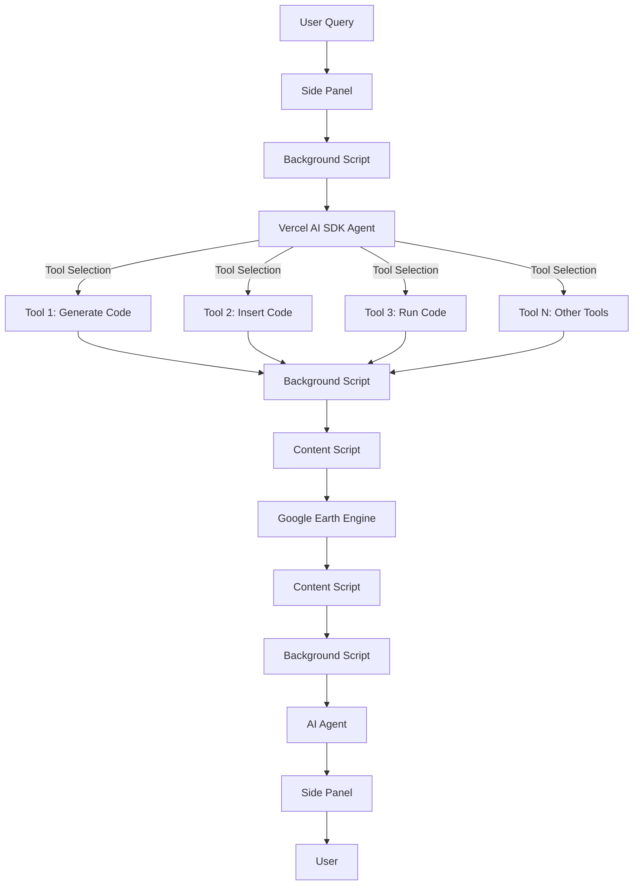

This architecture uses the **Vercel AI SDK** for agent capabilities, allowing:
- Sequential tool execution (generate → insert → run)
- In-context reasoning between steps
- Streaming responses during multi-step operations
- Client-side context management

### Server-Side Agent (Future Consideration)

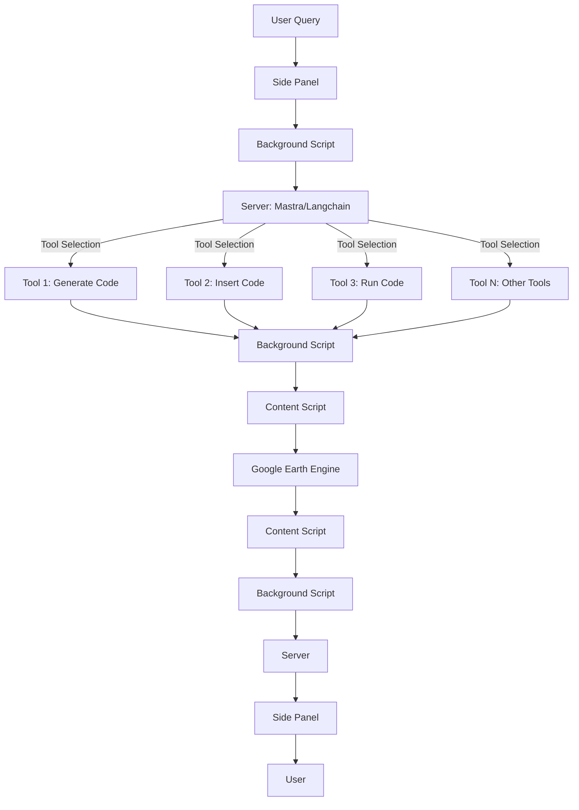

This approach would leverage server-side frameworks like **Mastra** or **Langchain** for:
- Persistent memory across sessions
- More complex multi-agent coordination
- Reduced client-side complexity
- Advanced tool orchestration

## Message Flow Patterns

### User Query Processing

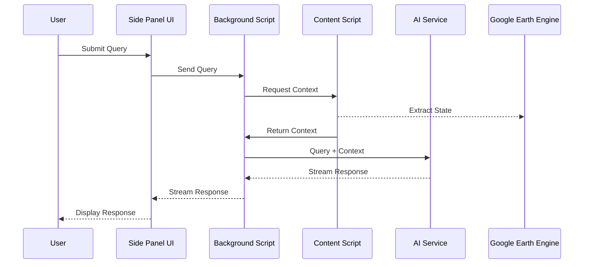

### Tool Execution Flow

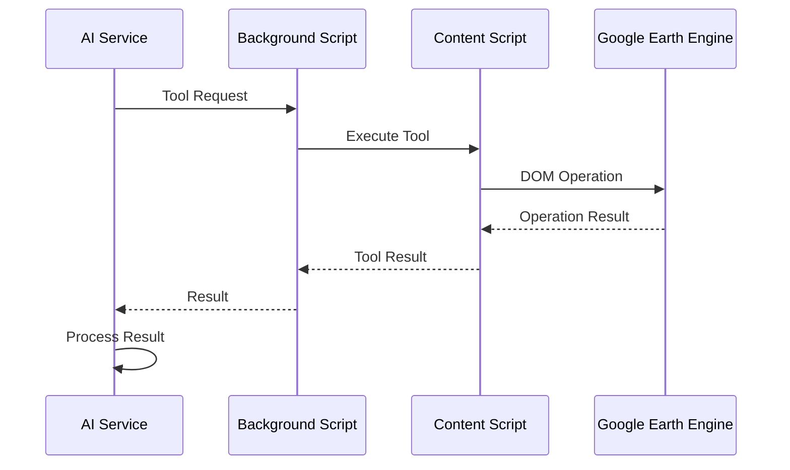

### Multi-Step Tool Execution Flow

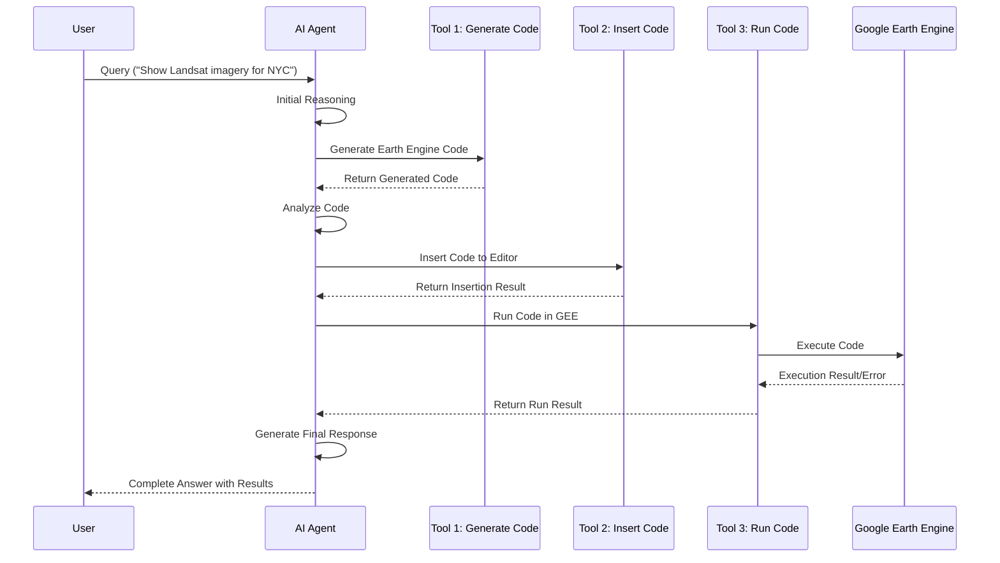

## Component Patterns

### Side Panel UI

The Side Panel is built as a React application with:

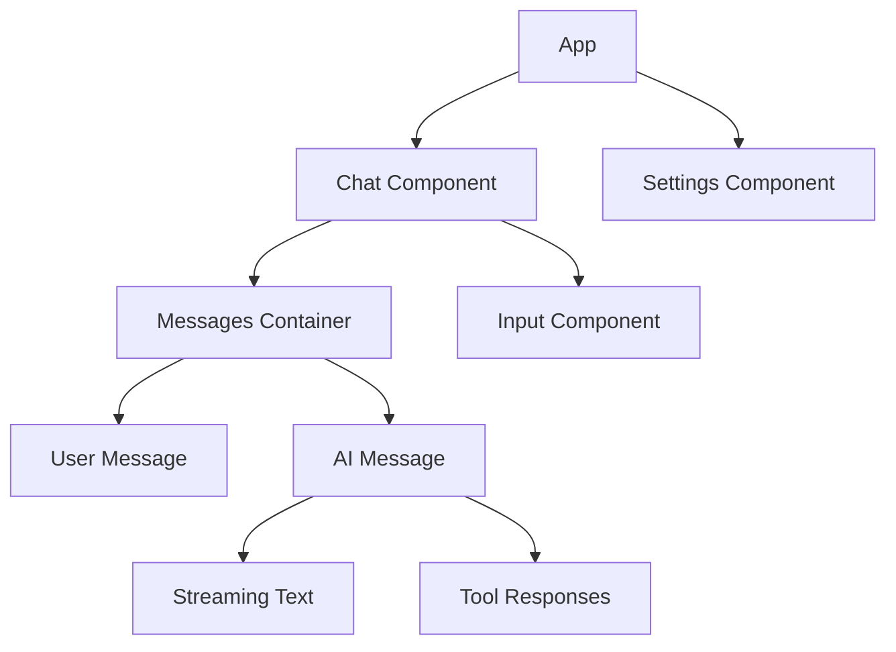

### Tools Implementation

Each tool follows a consistent pattern:

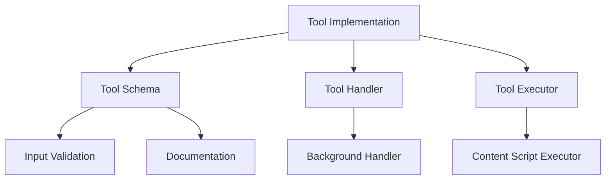

## Data Flow Patterns

### Context Gathering

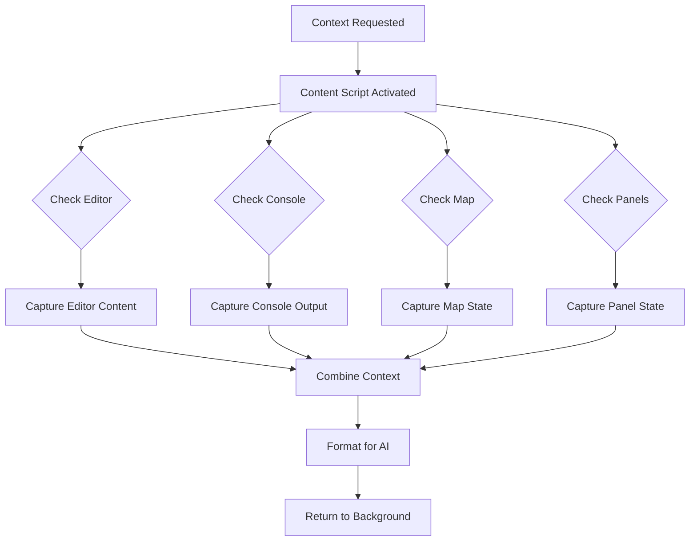

### User Interface State Management

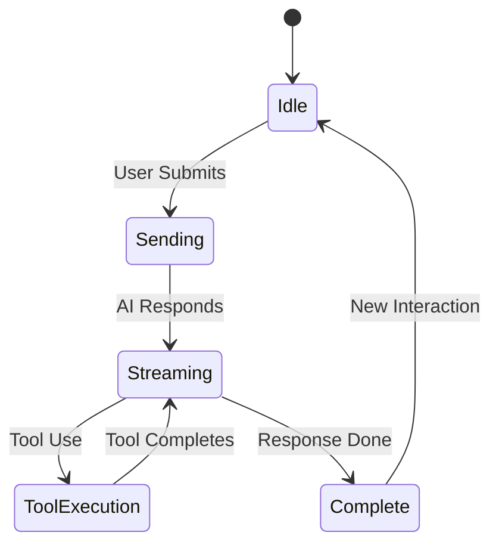

## Agent System Patterns

The agent system follows these patterns:

### Decision Making Flow

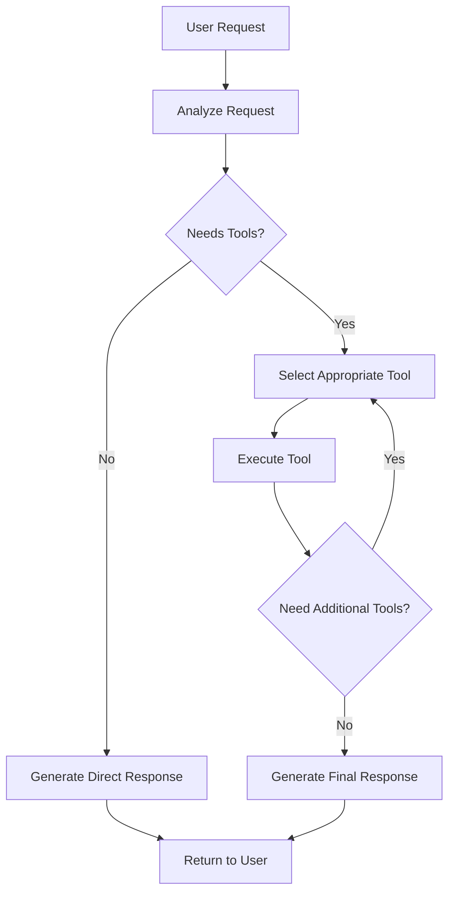

### Multi-Step Tool Execution Pattern

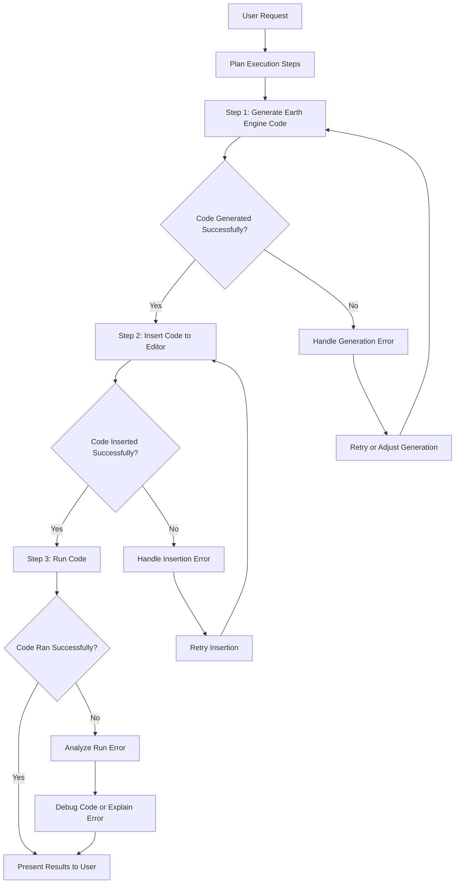

### Agent Implementation with Vercel AI SDK

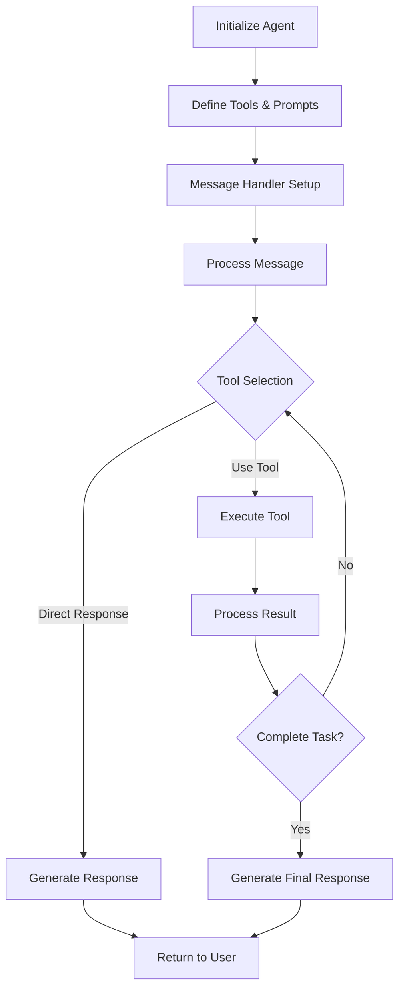

The implementation uses the Vercel AI SDK's agent capabilities following this pattern:
- Tool definitions with JSON Schema
- Agent prompt with tool instructions
- FunctionCallingHandler for tool execution  
- Tool callbacks for content script operations
- Stream handling for progressive responses

## Error Handling Patterns

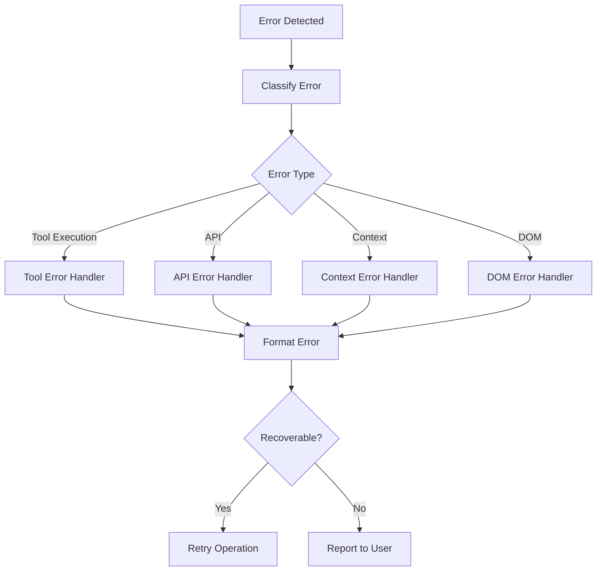

## Security Patterns

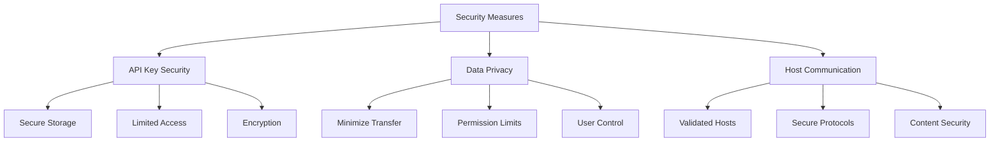

## Memory and State Management

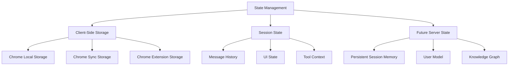

## Testing Patterns

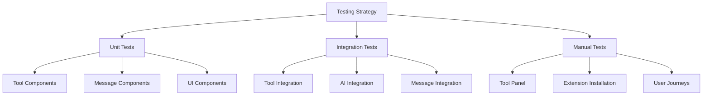

## Extension Integration Points

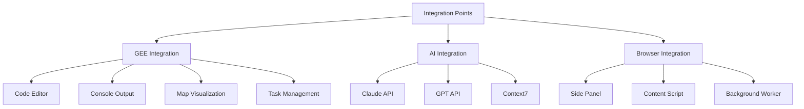

## Development Workflow

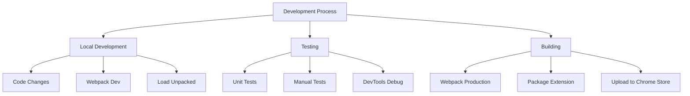

## Performance Optimization

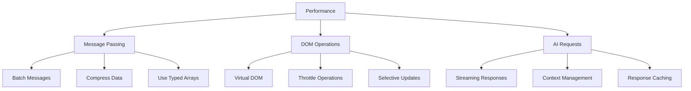

## Future Architecture Considerations

### Potential Server-Side Components

```mermaid
graph TD
    Client[Chrome Extension] <--> Server[Server Components]
    Server --> Memory[Memory Bank]
    Server --> Agents[Agent Orchestration]
    Server --> KG[Knowledge Graph]
    Server --> Analytics[Usage Analytics]
    Memory --> Session[Session Persistence]
    Memory --> User[User Preferences]
    Memory --> History[Conversation History]
```

### Multi-Agent System

```mermaid
graph TD
    Coordinator[Agent Coordinator] --> CodeAgent[Code Generation Agent]
    Coordinator --> VisAgent[Visualization Agent]
    Coordinator --> DataAgent[Dataset Agent]
    Coordinator --> DebugAgent[Debug Agent]
    CodeAgent & VisAgent & DataAgent & DebugAgent --> Tools[Shared Tool Library]
```

### Progressive Enhancement

```mermaid
flowchart TD
    Phase1[Phase 1: Client-Only] --> Phase2[Phase 2: Client+Basic Server]
    Phase2 --> Phase3[Phase 3: Enhanced Server]
    Phase3 --> Phase4[Phase 4: Multi-Agent System]
    
    Phase1 --> P1F[Client-side AI SDK Agent]
    Phase1 --> P1T[Basic Tool Set]
    
    Phase2 --> P2M[Server Memory Persistence]
    Phase2 --> P2A[Enhanced Agent Capabilities]
    
    Phase3 --> P3K[Knowledge Integration]
    Phase3 --> P3C[Custom Training]
    
    Phase4 --> P4MA[Multiple Specialized Agents]
    Phase4 --> P4O[Orchestration Layer]
``` 