# 🗺️ Product Roadmap

## 1. Core Agentic Intelligence (Stability & Reasoning)
**Goal:** Make the agent a reliable, autonomous coding partner.

- [ ] **Planner / Reflection Loop (High Priority)**
    - Implement a lightweight "Plan-Execute-Reflect" cycle (max X steps).
    - Track sub-goals, tools used, and successful/failed outcomes.
    - Self-correction: dynamic decision making based on execution results.
- [ ] **Automated Verification**
    - `auto-verify`: After `run_code`, automatically check `getConsoleOutput` vs expected results.
    - Feed execution logs/errors back into the prompt to prevent hallucinated success.
- [ ] **State Memory Management**
    - Context retention: Remember current code, selected entries, and recent outputs to reduce API calls.
    - Caching: Cache expensive operations like dataset queries (`geeDocs` results).
- [ ] **Diff Preview**
    - Show visual diffs for large code changes before insertion.
    - User confirmation workflow for destructive edits.
- [ ] **Web Search Agent**
    - Integrate Perplexity-style web search for real-time GEE examples and debugging.

## 2. User Experience (UX)
**Goal:** Seamless workflow integration.

- [ ] **Session Management**
    - Local storage for chat history.
    - [ ] Export/Import sessions (JSON/Markdown).
- [ ] **Code Versioning**
    - Full history tracking (beyond simple undo).
    - Ability to revert to any previous script version in the session.
- [ ] **Workflow Templates**
    - Save commonly used prompts or "recipes" (e.g., "Sentinel-2 Cloud Masking").
    - Keyboard shortcuts for common actions.
- [ ] **UI Polish**
    - Better loading states during long agent actions.
    - Clearer error messages when tools fail.

## 3. Feature Extensions
**Goal:** Expand capabilities beyond basic coding.

- [ ] **Smart Map Interactions**
    - `inspectMapLocation` (High-Level Tool): Combine `getMapScreenPosition` → `click` → `wait` → `getInspectorOutput` into one robust action.
- [ ] **Code Analysis & Linting**
    - **Style Check**: Auto-format code to GEE best practices.
    - **Perf Check**: Warning for computationally expensive patterns (e.g., `.getInfo()` inside loops).
- [ ] **Local Ecology (Low Priority)**
    - Upload user data (Shapefiles/GeoJSON) to GEE assets.
    - Save analysis results (CSV/GeoTIFF) to local disk.

## 5. Evaluation & Data
**Goal:** Data-driven improvements.

- [ ] **Benchmarking**
    - Create a standard dataset of GEE tasks (simple queries to complex analyses).
    - Define metrics: Pass rate, Code efficiency, Number of turns to solve.
- [ ] **Fine-Tuning**
    - Curate high-quality GEE script-explanation pairs.
    - Fine-tune a specialized model (e.g., Llama-3-GEE or similar) for better syntax accuracy.

---

## 💡 Strategic Suggestions

### A. Community & Sharing ("Earth Snippets")
**Suggestion**: Build a feature to one-click share a conversation or a generated script as a Gist or a publicly accessible URL.
- **Why?** GEE is community-heavy. Making your tool the easiest way to share working solutions will drive growth.

### B. Interactive Onboarding
**Suggestion**: Create a "First Run" interactive tutorial where the agent guides the user to creating their first map.
- **Why?** New users might not know what to ask. A structured "Hello World" workflow builds confidence.

### C. "Explain My Map" Multimodal Feature
**Suggestion**: Since you have screenshot capabilities (via MCP/Extension), double down on the "Vision" aspect.
- **User Action**: Click "Explain this Map".
- **Agent**: Takes screenshot + Inspector data → Explains what biological/urban phenomenon is visible.

---

## 📊 Roadmap Visualization

```mermaid
graph TD
    Root[Earth Agent Roadmap]
    style Root fill:#f9f,stroke:#333,stroke-width:2px

    %% Core Intelligence
    Root --> Core[Core Intelligence]
    style Core fill:#bbf,stroke:#333
    Core --> Planner["Planner Loop (High Priority)"]
    Core --> AutoVerify[Auto Verification]
    Core --> Memory[State Memory]
    Core --> Diff[Diff Preview]
    Core --> Web[Web Search]

    %% UX
    Root --> UX[User Experience]
    style UX fill:#bfb,stroke:#333
    UX --> Sessions[Session Mgmt]
    UX --> Versioning[Code Versioning]
    UX --> Templ[Workflow Templates]
    UX --> Polish[UI Polish]

    %% Extensions
    Root --> Ext[Extensions]
    style Ext fill:#fbf,stroke:#333
    Ext --> SmartMap[Smart Map Tools]
    Ext --> Linting[Linting & Perf]
    Ext --> Local[Local Ecology]

    %% Data
    Root --> Data[Eval & Data]
    style Data fill:#ffb,stroke:#333
    Data --> Bench[Benchmarking]
    Data --> FineT[Fine-Tuning]
```



```text
+-----------------------------------------------------------------------------+
|                            EARTH AGENT ROADMAP                              |
+=============================================================================+
|                                                                             |
|  [1. INTELLIGENCE]       [2. UX]               [3. EXTENSIONS]              |
|  -----------------       -------               ---------------              |
|  • Planner Loop          • Session Mgmt        • Smart Map Tools            |
|  • Auto Verification     • Versions/Undo       • Code Linting               |
|  • State Memory          • Templates           • Perf Checks                |
|  • Diff Preview          • UI Polish           • Local Data (Low Priority)  |
|  • Web Search Agent                                                         |
|                                                                             |
|                          [5. DATA & EVAL]                                   |
|                          ----------------                                   |
|                          • Benchmarking                                     |
|                          • Model Fine-Tuning                                |
|                                                                             |
+-----------------------------------------------------------------------------+
```
